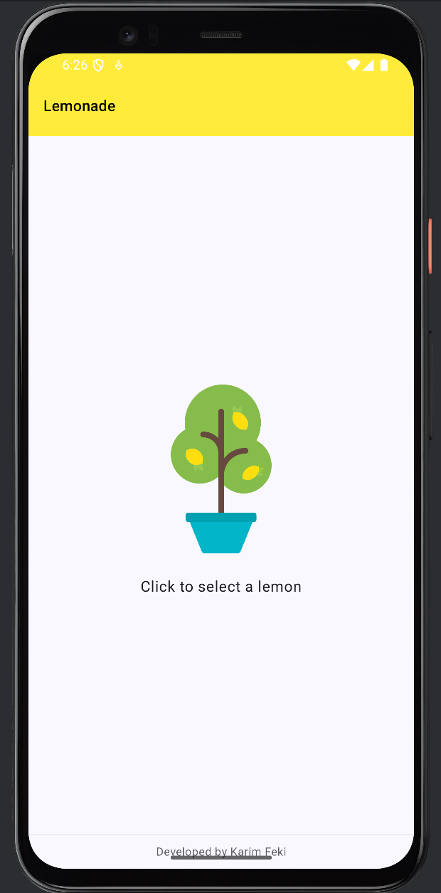
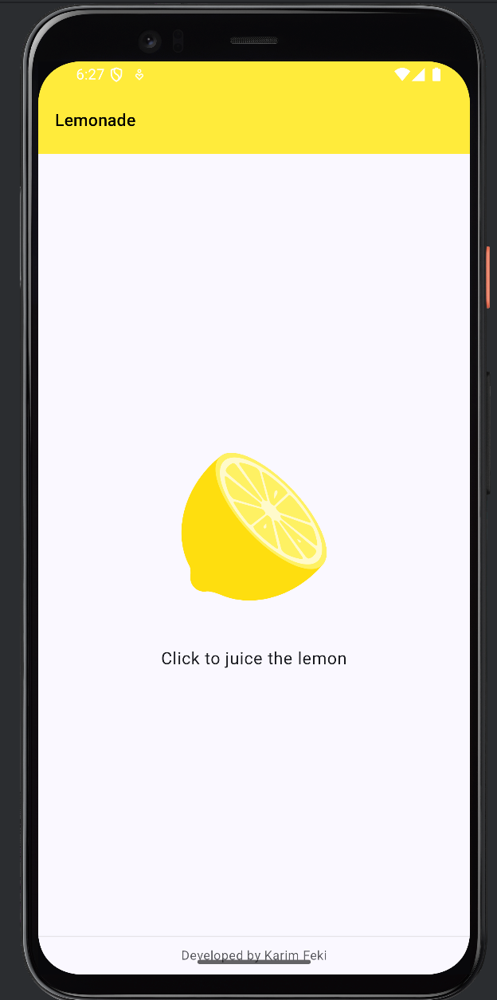
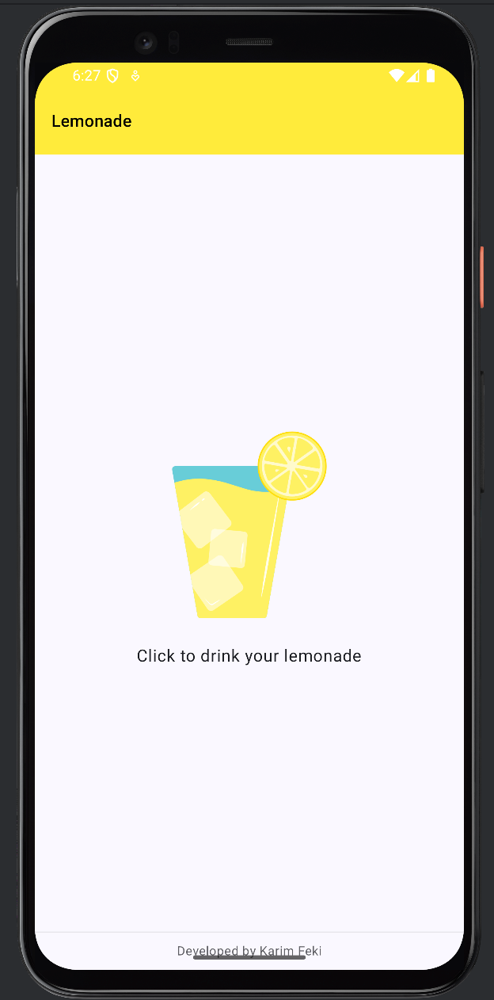
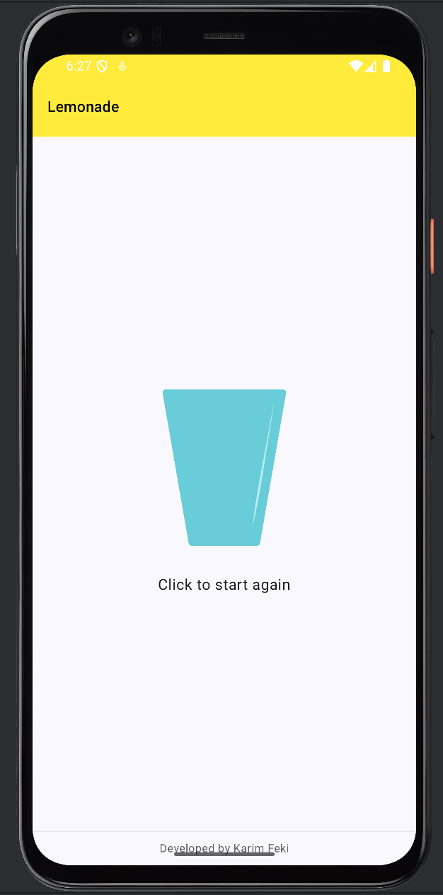

# Lemonade App

A lightweight Android application built with Kotlin and Jetpack Compose that demonstrates state-driven UI and simple user interaction patterns.


## Table of Contents
- [About](#about)
- [Demo](#demo)
- [Key Features](#key-features)
- [Technologies](#technologies)
- [Getting Started](#getting-started)
  - [Prerequisites](#prerequisites)
  - [Open in Android Studio](#open-in-android-studio)
  - [Command-line build](#command-line-build)
- [Run on device / emulator](#run-on-device--emulator)
- [Project Structure](#project-structure-high-level)
- [Testing](#testing)
- [Contributing](#contributing)
- [License](#license)
- [Acknowledgements](#acknowledgements)


## About

👨‍💻 About Academic Project

Project completed as part of the 4th year SIM curriculum at ESPRIT — Private Higher School of Engineering and Technologies.

Author: Karim Feki

Computer & Mobile Systems Engineering Student

📧 Email: [feki.karim28@gmail.com](mailto:feki.karim28@gmail.com)

💼 LinkedIn: [linkedin.com/in/karimfeki](https://www.linkedin.com/in/karimfeki/)

🐙 GitHub: [github.com/fekikarim](https://github.com/fekikarim)


## Demo
Include screenshots/GIFs in `app/demo/` and reference them here. Example:

| Demo 1 | Demo 2 |                  Demo 3                   |                 Demo 4                 |
|---:|:---:|:-----------------------------------------:|:--------------------------------------:|
|  |  |  |  |
| Home / Pick a lemon | Picked lemon | Drink | Restart |

*Figure: A short walkthrough — (1) Home / Pick a lemon, (2) Picked lemon, (3) Squeezing, (4) Drink & restart.*


## Key Features
- Simple, educational four-stage lemonade flow (pick a lemon, squeeze, drink, and restart).
- Built with Jetpack Compose (Compose-first UIs and state handling).
- Material 3 styling and responsive layout.
- Small, readable codebase ideal for learning Android UI state management.


## Technologies
- Kotlin
- Jetpack Compose (Material 3)
- Android Gradle Plugin & Gradle Kotlin DSL
- Android Studio (recommended)


## Getting Started

### Prerequisites
- macOS (or Windows/Linux with equivalent Android tooling)
- Android Studio (Arctic Fox or newer recommended; matching the project's Gradle plugin)
- JDK 11 or newer
- Android SDK and an emulator or a physical Android device


### Open in Android Studio
1. Clone the repository:

```bash
git clone https://github.com/fekikarim/your-repo-name.git
cd LemonadeApp
```

2. Open Android Studio → File → Open... → select the project folder.
3. Allow Gradle to sync and download dependencies.


### Command-line build
From the project root:

```bash
# Assemble debug APK
./gradlew assembleDebug

# Run unit tests
./gradlew test

# Install debug build onto a connected device/emulator
./gradlew installDebug

# Run instrumentation tests (device/emulator required)
./gradlew connectedAndroidTest
```


## Run on device / emulator
1. Start an Android emulator from AVD Manager or connect a device via USB with developer mode enabled.
2. In Android Studio select the app module and an available device, then click Run (▶️).
3. Or use the CLI:

```bash
./gradlew installDebug
adb shell am start -n "com.yourapp.package/.MainActivity"
```

Replace `com.yourapp.package` with the actual applicationId in `app/build.gradle.kts`.


## Project Structure (high level)
- `app/` — Android application module.
  - `src/main/java/` — Kotlin/Java source files and Compose UI code.
  - `src/main/res/` — Resources (drawables, strings, layouts if any).
  - `build.gradle.kts` — module Gradle configuration.
- `build.gradle.kts`, `settings.gradle.kts` — workspace-level Gradle configuration.


## Testing
- Unit tests: `./gradlew test`
- Instrumentation tests: `./gradlew connectedAndroidTest` (requires device/emulator)


## Contributing
Contributions are welcome. Suggested workflow:
1. Fork the repository.
2. Create a feature branch: `git checkout -b feat/your-feature`.
3. Commit changes and push to your fork.
4. Open a pull request with a clear description of the change.

Please follow these guidelines:
- Keep changes small and focused.
- Update or add tests for new behavior.
- Follow existing code style and Compose patterns used in the project.


## License
This project does not include a license file by default. If you want to allow open-source reuse, consider adding an MIT license. Example `LICENSE` content:

```
MIT License

Copyright (c) 2025 Karim Feki

Permission is hereby granted, free of charge, to any person obtaining a copy
of this software and associated documentation files (the "Software"), to deal
in the Software without restriction, including without limitation the rights
to use, copy, modify, merge, publish, distribute, sublicense, and/or sell
copies of the Software, and to permit persons to whom the Software is
furnished to do so, subject to the following conditions:

[...standard MIT license body...]
```


## Acknowledgements
- Educational project completed as part of the SIM curriculum at ESPRIT.
- Jetpack Compose and Android developer documentation.


---

If you'd like, I can:
- Insert your real applicationId into the run command by reading `app/build.gradle.kts`.
- Add sample screenshots to `docs/screenshots/` and reference them properly.
- Add a `LICENSE` file (MIT) and commit it.

Tell me which of these (if any) you'd like me to do next.
